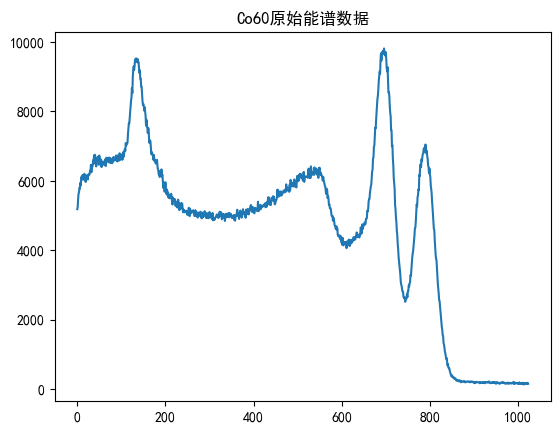
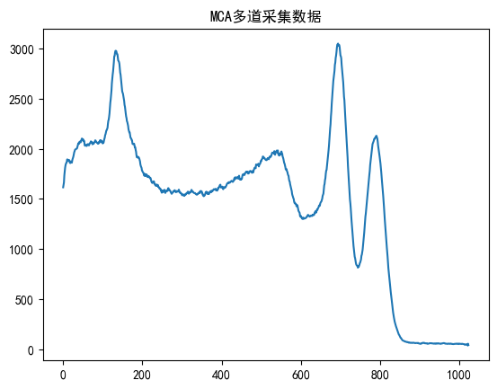
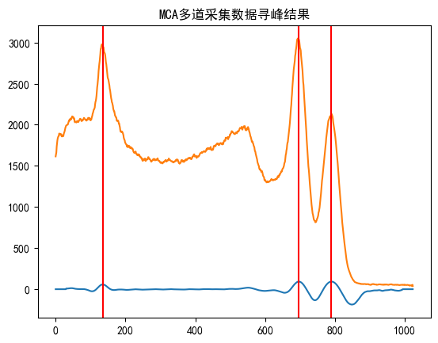
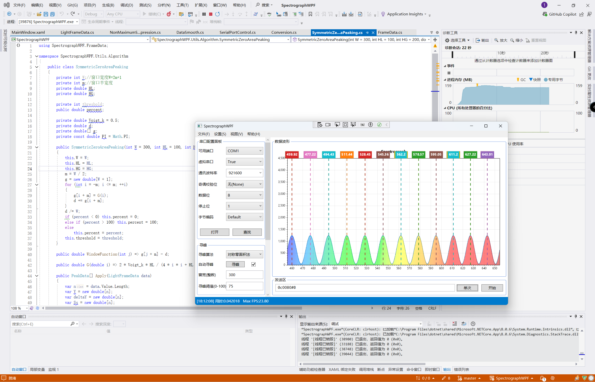

# 多道脉冲高度分析器（MCA）仿真器

## 设计概述
本项目实现了一个多道脉冲高度分析器（Multi-Channel Analyzer, MCA），使用Verilog和Python实现。MCA的主要功能包括启停控制、复位控制、PHA（Pulse Height Analysis）方式分析随机脉冲高度、能谱统计、能谱数据存储、能谱平滑处理、能谱显示以及能谱寻峰功能。

## 功能实现与模块设计
### 启停控制、复位控制:
Verilog模块中使用了rst信号进行控制。初始化后，rst被置为0，开始计数和数据处理；置为1时，重置所有内部状态。

### PHA方式分析随机脉冲高度:
使用Verilog编写了逻辑以模拟随机脉冲的发生，并在初始化阶段对能谱进行统计。

### 能谱统计和存储:
能谱统计通过Verilog实现，将统计结果存储在count数组中。使用Verilog的文件操作功能，将结果输出到out.hex文件中。Python脚本负责读取out.hex文件并绘制能谱图，同时支持绘制能谱寻峰结果。

### 能谱平滑处理:
实现了移动平均功能来平滑能谱数据，通过Verilog中的moving_average函数实现。

### 能谱显示:
Python脚本利用matplotlib库显示能谱数据，并在能谱图中标示出寻找到的峰值。

 
原始能谱

 
平滑后的能谱

 
能谱寻峰结果

蓝色线为寻峰算法对能谱数据的打分（分值越高，则认为在这里存在峰的可能越大），橙色色线为能谱数据。

### 能谱寻峰:
由于verilog中的exp和log等常用数学算法不易实现，因此在Python中实现了能谱寻峰功能(main.ipynb)。通过定义对称零区面积峰值算法（Symmetric Zero Area Peaking）和非极大值抑制算法（Non-Maximum Suppression），对能谱数据进行处理，并标示出峰值位置。

寻峰算法是我在另一个项目简易光谱仪的研制中实现的，这里把算法从c#移植到了Python。算法的基本思想是：
1. 通过对称零区面积峰值算法，找到能谱中的峰值；
2. 通过非极大值抑制算法，对峰值进行优化。

 使用C#实现的光谱仪软件界面(https://github.com/travellerse/SpectrographWPF)

## 编程环境
- Verilog仿真环境：iverilog + vscode + WaveTrace(Vscode插件)

## 总结
通过本项目，我们实现了一个基本的MCA功能模拟器，结合Verilog和Python编程。Verilog部分负责硬件仿真和基本计算，Python部分负责数据处理、可视化和附加算法实现。

项目中遇到的主要挑战包括：
- Verilog中时序逻辑的编写和仿真验证；
- Python与Verilog数据交互的技术实现；
- 能谱数据处理算法的设计和优化。

未来可以进一步优化的方向包括：
- 提升Verilog模块的复用性和灵活性；
- 实现更复杂的PHA分析和峰值检测算法；
- 引入实时数据处理和更高效的存储方法。
